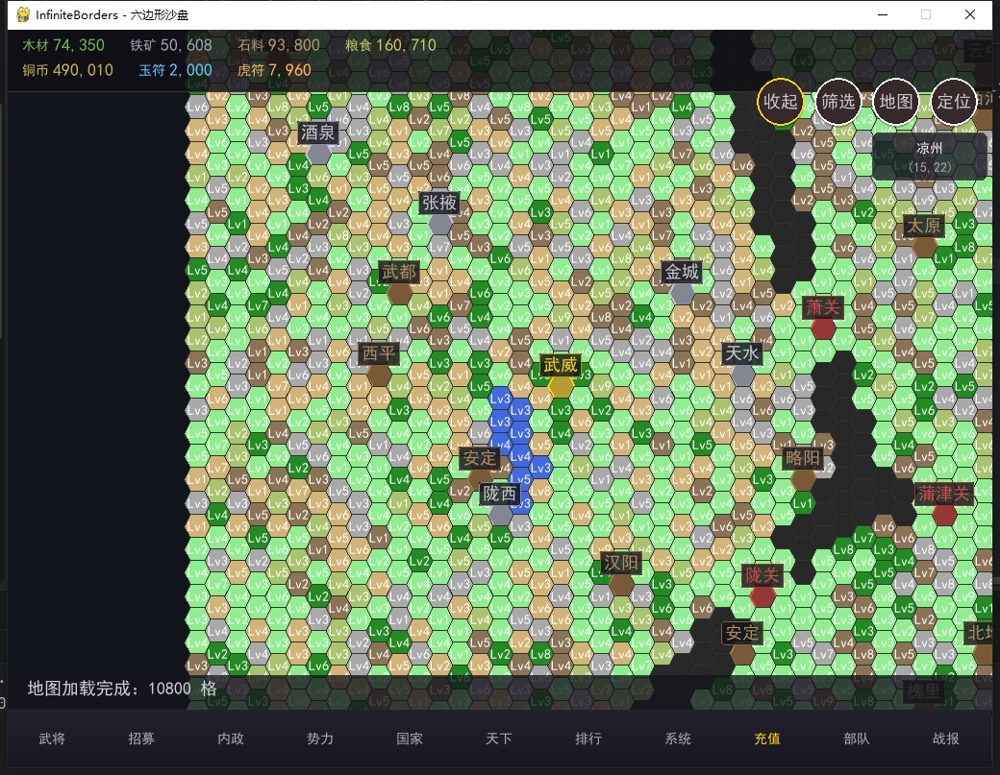
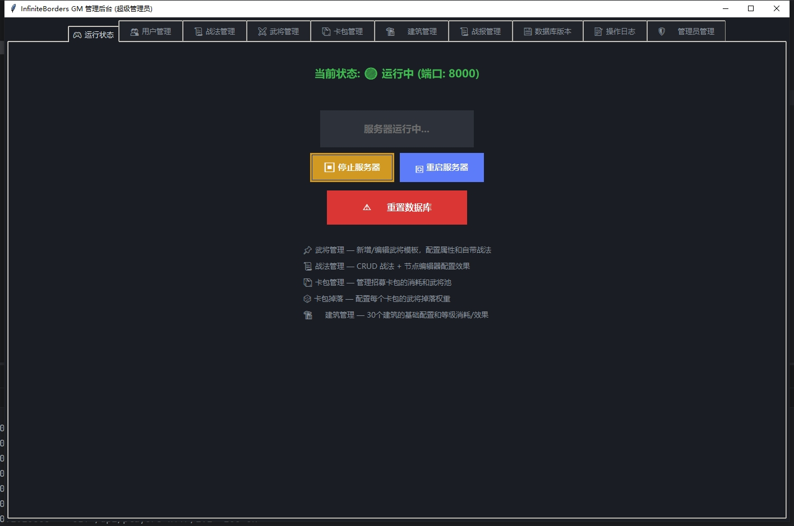

# InfiniteBorders

> 类率土之滨的 2D MMO SLG 沙盘战略游戏

一个基于 Python 的多人大在线策略游戏，玩家在 10800 格六边形网格地图上发展势力、招募武将、配置战法、出征战斗。

## 技术栈

| 层级 | 技术 |
|------|------|
| 服务端 | Python 3.11 + FastAPI + WebSocket + SQLAlchemy + SQLite |
| 客户端 | Pygame + asyncio + websockets |
| 工具链 | tkinter（GM 控制台、节点编辑器、建筑配置编辑器） |
| 通信 | WebSocket（JSON） |

## 项目结构

```
├── InfiniteBordersServer/    # 服务端
│   ├── server.py             # FastAPI 入口 + WebSocket 端点
│   ├── core/                 # 核心逻辑（战斗引擎、连接管理、游戏循环）
│   ├── models/               # 数据库模型（SQLAlchemy ORM）
│   ├── ws_handlers/          # WebSocket 消息处理器
│   ├── gm_console/           # GM 控制台（tkinter）
│   ├── node_editor.py        # 战法节点图可视化编辑器（tkinter）
│   ├── data_editor.py        # 数据编辑器（武将/战法/卡包/建筑）
│   ├── building_configs.py   # 30 种建筑定义
│   ├── init_db.py            # 数据库初始化
│   └── ...
├── InfiniteBordersClient/    # 客户端
│   ├── main.py               # Pygame 入口 + 状态管理
│   ├── network.py            # WebSocket 通信层
│   ├── ui/                   # UI 面板模块
│   │   ├── hud.py            # HUD 绘制
│   │   ├── map_renderer.py   # 六边形地图渲染
│   │   ├── hero_panel.py     # 武将面板
│   │   ├── troops_panel.py   # 部队面板
│   │   ├── building_panel.py # 建筑面板
│   │   └── report_panel.py   # 战报面板
│   └── ...
├── shared/                   # 共享模块
│   └── protocol.py           # 通信协议定义（单一权威源）
├── requirements.txt
└── PROJECT_DOCUMENTATION.md  # 完整项目文档
```

## 核心特性

### 六边形大地图
- Pointy-top 六边形网格，120×90 = 10800 格
- 十三州版图（司隶、雍州、兖州、豫州等）
- 154 座城池 + 28 个关口
- 多种地形（平原、树林、铁矿、石料、山脉）
- 支持缩放、拖动、宏观地图

### 战斗系统
- 回合制自动战斗（最多 8 回合）
- 4 种武将站位（前锋/中军/大营）
- 武将属性 + Buff 系统
- 平局重战机制（最多 50 场）
- 结构化战报（JSON 格式 + 历史记录）

### 战法节点图系统
- 26 种可视化节点类型（事件/流程/条件/效果/目标/数值）
- 拖拽连线配置战法效果，零代码
- 内置图结构校验（入口检测、孤立节点检测）
- 支持复杂战法：条件分支、循环遍历、延迟触发、状态快照

### 主城建筑系统
- 30 种建筑（城主府、校场、兵营、点将台等）
- 双重解锁体系（城主府等级 + 前置建筑组合）
- 资源产出集成（木材/铁矿/粮草/石料/铜币）
- 建筑效果注入战斗系统

### GM 工具链
- GM 控制台：武将/战法/卡包/建筑/数据库管理
- 节点编辑器：可视化配置战法效果
- 建筑配置编辑器：表格化编辑 30 种建筑
- 数据库快照：上传/恢复/导出
- 配置与数据分离，修改配置不丢失玩家进度

## 快速开始

### 环境要求

- Python 3.11+
- 依赖：见 `requirements.txt`

### 安装

```bash
# 创建虚拟环境
python -m venv .venv

# 激活（Windows）
.venv\Scripts\Activate.ps1

# 安装依赖
pip install -r requirements.txt
```

### 启动

```bash
# 1. 启动服务端
cd InfiniteBordersServer
python server.py
# FastAPI 监听 0.0.0.0:8000，同时启动 GM 控制台

# 2. 启动客户端（新终端）
cd InfiniteBordersClient
python main.py
# Pygame 窗口 1024x768，连接 ws://127.0.0.1:8000
```

### 初始化数据库

```bash
cd InfiniteBordersServer
python init_db.py  # 全量重置（删除所有数据重建）
```

## 通信协议

服务端与客户端共用 `shared/protocol.py` 作为协议定义的单一权威源，包含以下协议类型：

| 分类 | 协议 | 说明 |
|------|------|------|
| 基础 | cmd_login / res_login | 登录 |
| 基础 | sync_state / sync_map | 状态同步 / 地图增量推送 |
| 基础 | push_report / error | 战报推送 / 错误 |
| 武将 | req_heroes / cmd_rank_up 等 | 武将管理 |
| 部队 | req_troops / cmd_edit_troop 等 | 部队管理 |
| 行军 | cmd_march | 行军出征 |
| 招募 | req_packs / cmd_recruit | 卡包抽卡 |
| 建筑 | req_buildings / cmd_upgrade_building 等 | 建筑系统 |
| 战报 | req_report_history | 战报历史 |

## 截图

### 游戏客户端


### GM 控制台


## 开发规范

- 代码注释：中文
- 缩进：4 空格
- 新增战法：通过节点编辑器拖拽配置
- 新增建筑：在 `building_configs.py` 中添加定义
- 新增协议：在 `shared/protocol.py` 中添加常量

## 文档

完整的架构文档、数据库模型、API 说明请参阅 [PROJECT_DOCUMENTATION.md](PROJECT_DOCUMENTATION.md)。

## License

MIT
